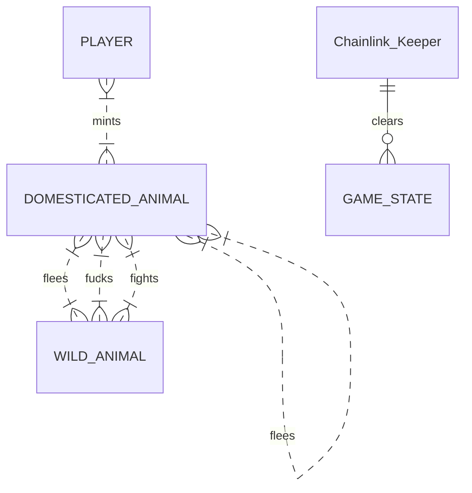
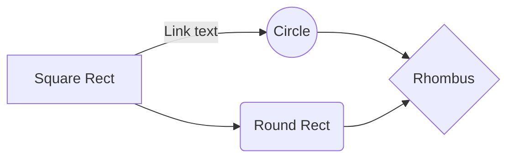

# Safari Bang
Welcome to Safari Bang, and adult wilderness survival NFT game built with Foundry deployed on Polygon. 

## Gameplay

You begin by minting or purchasing a starter animal with certain attributes. You explore the wilderness and encounter other animals that are either wild (unminted) or tamed (minted). Each interaction you have the choice to either fight, fuck, or flee. There is no winner in the wild, only losers and survivors who haven't died or been fucked yet. After a month of gameplay, the state is wiped by an asteroid and all animals become wild again.

A animal is given 10 turns to begin. 

Each time they successfully conceive an animal, they get 10 turns.
Each time they flee, they lose 2 turns.
Each time they lose a fight, they lose 3 turns.

If they run out of turns, their animals are made wild again and scattered randomly around the map.

Each time you click next turn, a VRF determines your position on a 2D array map. Your first turn you are dropped on a random coordinate, but after that you cannot teleport so you will move by some vector [x,y] from your current position.

If you land on the same position as another animal, then you will be forced to either fight, fuck, or flee. The other animal's action will be randomly chosen unless it is owned by another animal.

If you land on a square with multiple other animals, you will be moved [0, 1] until you land on a square with either 0 or 1 animal.

If you reach an edge, you will wrap around to the other side of the map since out game world is not flat - unlike the real world, amirite? XD

#### Flee
When you try to flee, Chainlink VRF returns number that, if greater than threshold, will result in successful flee.

#### Fight
When you try to fight, 

#### Fuck
When you try to fuck, VRF number will determine whether successfully conceive. Then a new animal is released into the wild.

### What's the point?
Much like a lot of stuff in crypto, there is no bloody point. Just pay gas and pay to play just because blockchain. This is a game for enjoyoors. 

On my end however, there is a point, which is to learn. For me as a developer, this is a very fun spec to work through to build my first NFT game, build my first Foundry dapp, and to deploy to Polygon Mainnet for the first time. I also get to revisit Chainlink Keepers after briefly touching on it in the Chainlink Hackathon.

So in conclusion there is no point to this game except for my own learning and your burning precious gas. But relax it's on Polygon so you won't even spend that much. Plus you get to own some pointless jpegs remember how "revolutionary" that was just months ago? Yeah.

## Gameplay (Visual)

And this will produce a flow chart:

## How it works under the hood

