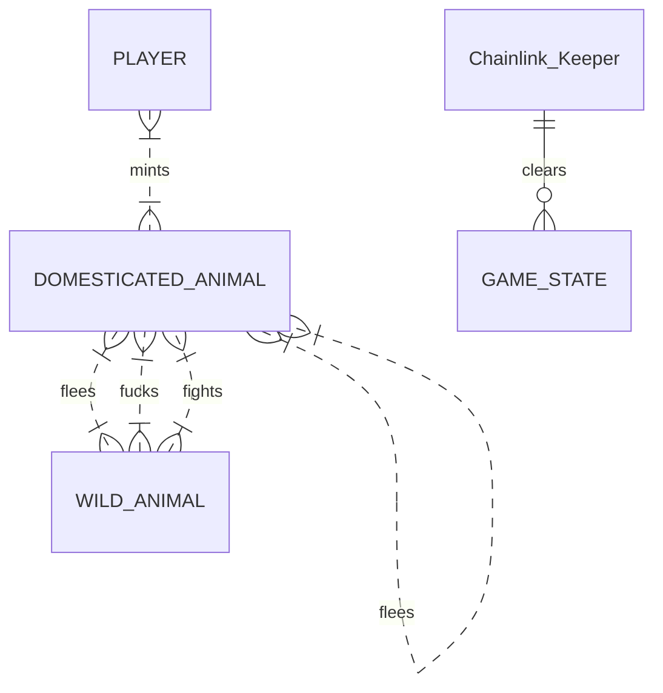
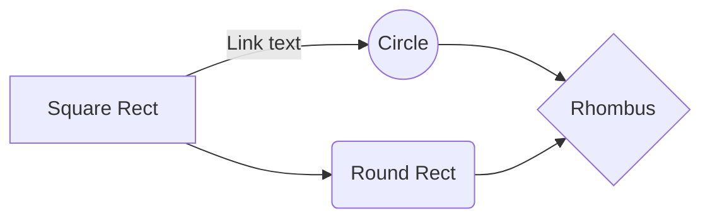

# Safari Bang
Welcome to Safari Bang, and adult wilderness survival NFT game built with Foundry deployed on Polygon. 

## Gameplay

You begin by minting or purchasing a starter animal with certain attributes. You explore the wilderness and encounter other animals that are either wild (unminted) or tamed (minted). Each interaction you have the choice to either fight, fuck, or flee. There is no winner in the wild, only losers and survivors who haven't died or been fucked yet. After a month of gameplay, the state is wiped by an asteroid and all animals become wild again. Only wild animals can fuck domesticated animal. 

### What's the point?
Much like a lot of stuff in crypto, there is no bloody point. Just pay gas and pay to play just because blockchain. This is a game for enjoyoors. 

On my end however, there is a point, which is to learn. For me as a developer, this is a very fun spec to work through to build my first NFT game, build my first Foundry dapp, and to deploy to Polygon Mainnet for the first time. I also get to revisit Chainlink Keepers after briefly touching on it in the Chainlink Hackathon.

So in conclusion there is no point to this game except for my own learning and your burning precious gas. But relax it's on Polygon so you won't even spend that much. Plus you get to own some pointless jpegs remember how "revolutionary" that was just months ago? Yeah.

## Gameplay (Visual)

And this will produce a flow chart:

## How it works under the hood

